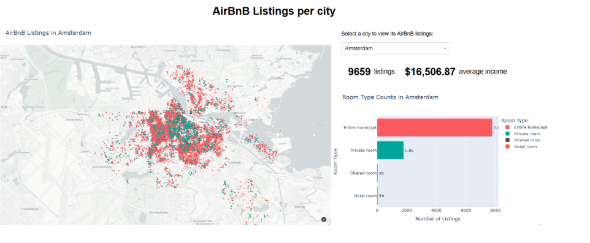

# Exploring AirBnB in Europe

This Jupyter Notebook (`AirbnbEu.ipynb`) contains a comprehensive exploratory data analysis of AirBnB listings across several major European cities. The project aims to provide data-driven insights into listing distribution, price dynamics, and host activity. The purpose of this project is to reproduce the valuable insights provided by the website Inside AirBnb without having access to the same data as the creators.



### 1. AirBnB Listings Overview

* **City Coverage:** Calculates and visualizes the total number of AirBnB listings across 11 major European cities: **Amsterdam, Athens, Barcelona, Berlin, Copenhagen, Dublin, Lisbon, Madrid, Rome, Venice, and Vienna**.

### 2. AirBnB Densities (Spatial Analysis)

* **Density Calculation:** Calculates the density of listings per **1,000 residents** for each neighborhood.
* **External Data Integration:** Integrates geographical population data (aggregated per 1km² area) sourced from the **WorldPop** research program of the University of Southampton.
* **Interactive Visualization:** Generates an **interactive map** using plot points colored by listing density, focusing on the geographical boundaries of each city.

### 3. AirBnB Prices

* **Price Metrics:** Analyzes the average price per city.
* **Booking Estimation:** Calculates the estimated **average nights booked per city** based on the `minimum_nights` requirement.
* **Distribution Analysis:** Uses **violin plots** for visual comparison of the pricing distribution across the different cities.

### 4. AirBnB Hosts

* **Top Host Identification:** Identifies and analyzes the **top hosts** based on the calculated number of listings they manage.
* **Host Distribution:** Visualizes how hosts are distributed by the number of listings they own (e.g., single-listing hosts, professional managers).

### 5. Interactive Dash Application

* **Simple Web App:** The final section of the notebook initializes a simple **Dash** application. The app is set up to run in the browser.

---

## Requirements and Setup

The project requires a set of data science libraries for data manipulation and visualization.

### Prerequisites

All required packages are listed in the generated `requirements.txt` file.

| Package | Purpose |
| :--- | :--- |
| `pandas`, `numpy` | Data manipulation and numerical operations |
| `plotly`, `altair` | Advanced data visualization |
| `geopandas`, `shapely` | Geospatial data handling and operations |
| `dash` | Building the interactive web application |
| `IPython`, `ipywidgets` | Enabling interactive elements within the notebook |

### Installation

1.  **Install dependencies:**
    ```bash
    pip install -r requirements.txt
    ```

2.  **Enable Jupyter Widgets (Crucial):**
    The dropdown selectors and interactive plots rely on the Jupyter widgets extension. You **must** run the following command in your terminal before launching the notebook:
    ```bash
    jupyter nbextension enable --py widgetsnbextension
    ```

### Running the Analysis

1.  Ensure your data files (AirBnB CSVs and WorldPop population CSVs) are correctly placed in a `data/` directory relative to the notebook.
2.  Launch Jupyter Notebook or JupyterLab:
    ```bash
    jupyter notebook
    ```
3.  Open `AirbnbEu.ipynb` and run all cells sequentially to reproduce the analysis. The Dash app will launch automatically when its cell is executed.
